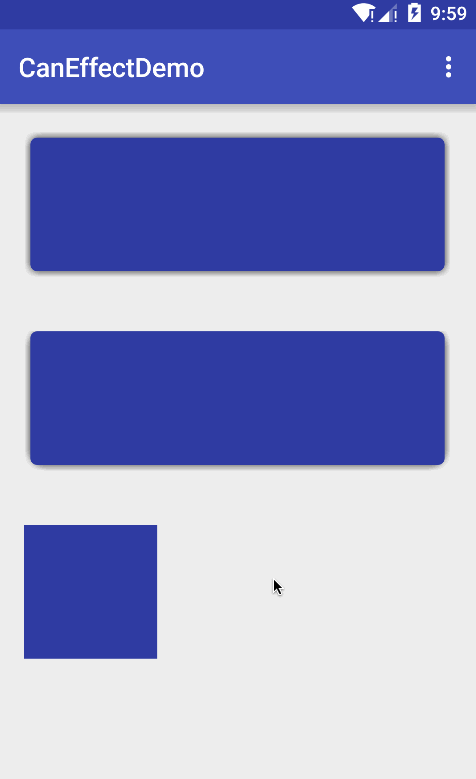

# CanEffect
android效果库，阴影效果、水纹效果、波纹效果、圆形显示过渡效果等。

 
   

##添加依赖
```JAVA
compile 'com.canyinghao:caneffect:1.0.3'
```

## 使用方式 
**1. 实现方法**  
CanEffect是一个效果库，兼容至sdk11。很多效果都是继承FrameLayout，通过重写draw方法，画图绘制的。圆形显示过渡的效果，在sdk21及以上可使用系统自带的效果，以下是通过drawChild绘制的，但包装成了与系统相似的方法，用法一致。
```JAVA
public final class ViewAnimationUtils {


    public static Animator createCircularReveal(View view, int centerX, int centerY, float startRadius, float endRadius) {


        if (Build.VERSION.SDK_INT >= Build.VERSION_CODES.LOLLIPOP) {
            return android.view.ViewAnimationUtils
                    .createCircularReveal(view, centerX, centerY, startRadius, endRadius);
        } else {

            return CanCircularRevealLayout.Builder.on(view)
                    .centerX(centerX)
                    .centerY(centerY)
                    .startRadius(startRadius)
                    .endRadius(endRadius)
                    .create();


        }


    }


}
``` 
**2. 使用方法**  
其它的阴影效果、水纹效果、波纹效果，使用方法如出一辙。
一些使用中的坑：
1.不要给CanRippleLayout、CanWaterWaveLayout添加点击或长按事件，不然它的子view接受不到事件。
2.如果使用了CanAdapter库，并且使用的是CanRVAdapter类，不要将CanRippleLayout、CanWaterWaveLayout放在item的最外层，CanRVAdapter的item的最外层view默认给了一个点击一个长按事件。
```JAVA
public class MainActivity extends AppCompatActivity {

    @Override
    protected void onCreate(Bundle savedInstanceState) {
        super.onCreate(savedInstanceState);
        setContentView(R.layout.activity_main);


        View view1 = findViewById(R.id.view1);
        View fl1 = findViewById(R.id.fl1);
        View view2 = findViewById(R.id.view2);
        View fl2 = findViewById(R.id.fl2);


        final View view3 = findViewById(R.id.view3);
        final View view4 = findViewById(R.id.view4);


        CanShadowDrawable.Builder.on(fl1)

                .radius(dp2Px(5))
                .shadowColor(Color.parseColor("#333333"))

                .shadowRange(dp2Px(5))
                .offsetTop(dp2Px(5))
                .offsetBottom(dp2Px(5))
                .offsetLeft(dp2Px(5))
                .offsetRight(dp2Px(5))
                .create();

        CanRippleLayout.Builder.on(view1).rippleCorner(dp2Px(5)).create();

        view1.setOnClickListener(new View.OnClickListener() {
            @Override
            public void onClick(View view) {
                Toast.makeText(getApplicationContext(), "onClick", Toast.LENGTH_SHORT).show();
            }
        });


        CanShadowDrawable.Builder.on(fl2)

                .radius(dp2Px(10))
                .shadowColor(Color.parseColor("#333333"))

                .shadowRange(dp2Px(5))
//                .offsetTop(dp2Px(5))
                .offsetBottom(dp2Px(5))
                .offsetLeft(dp2Px(5))
                .offsetRight(dp2Px(5))
                .create();

        CanWaterWaveLayout.Builder.on(view2).create();

        view2.setOnClickListener(new View.OnClickListener() {
            @Override
            public void onClick(View view) {
                Toast.makeText(getApplicationContext(), "onClick", Toast.LENGTH_SHORT).show();
            }
        });


        view3.setVisibility(View.GONE);
        view4.setOnClickListener(new View.OnClickListener() {
            @Override
            public void onClick(View view) {
                view4.setVisibility(View.GONE);
                view3.setVisibility(View.VISIBLE);


                Animator c1a = ViewAnimationUtils
                        .createCircularReveal(view3, 0, 0, (int) dp2Px(100), 1000);


                c1a.setDuration(1000);
                c1a.setInterpolator(new AccelerateDecelerateInterpolator());
                c1a.start();

            }
        });

        view3.setOnClickListener(new View.OnClickListener() {
            @Override
            public void onClick(View view) {


                Animator c1a = ViewAnimationUtils
                        .createCircularReveal(view3, 0, 0, 1000, (int) dp2Px(100));


                c1a.setDuration(1000);
                c1a.setInterpolator(new AccelerateDecelerateInterpolator());
                c1a.start();

                c1a.addListener(new Animator.AnimatorListener() {
                    @Override
                    public void onAnimationStart(Animator animator) {

                    }

                    @Override
                    public void onAnimationEnd(Animator animator) {
                        view3.setVisibility(View.GONE);
                        view4.setVisibility(View.VISIBLE);
                    }

                    @Override
                    public void onAnimationCancel(Animator animator) {

                    }

                    @Override
                    public void onAnimationRepeat(Animator animator) {

                    }
                });
            }
        });

    }


    float dp2Px(float dp) {
        return TypedValue.applyDimension(TypedValue.COMPLEX_UNIT_DIP, dp, getResources().getDisplayMetrics());
    }


    @Override
    public boolean onCreateOptionsMenu(Menu menu) {
        // Inflate the menu; this adds items to the action bar if it is present.
        getMenuInflater().inflate(R.menu.menu_main, menu);
        return true;
    }

    @Override
    public boolean onOptionsItemSelected(MenuItem item) {

        int id = item.getItemId();


        switch (id) {

            case R.id.action_1:


                startActivity(new Intent(MainActivity.this, ShadowActivity.class));

                break;
            case R.id.action_2:
                startActivity(new Intent(MainActivity.this, WaterActivity.class));


                break;
            case R.id.action_3:
                startActivity(new Intent(MainActivity.this, RippleActivity.class));
                break;
            case R.id.action_4:
                startActivity(new Intent(MainActivity.this, ShapeActivity.class));
                break;

            case R.id.action_5:
                startActivity(new Intent(MainActivity.this, XmlActivity.class));
                break;


        }

        return super.onOptionsItemSelected(item);
    }
}
``` 


### 开发者

 

canyinghao: 

<canyinghao@hotmail.com>  

[新浪微博](http://weibo.com/u/5670978460)

[google+](https://plus.google.com/u/0/109542533436298291853)

### License

    Copyright 2016 canyinghao

    Licensed under the Apache License, Version 2.0 (the "License");
    you may not use this file except in compliance with the License.
    You may obtain a copy of the License at

       http://www.apache.org/licenses/LICENSE-2.0

    Unless required by applicable law or agreed to in writing, software
    distributed under the License is distributed on an "AS IS" BASIS,
    WITHOUT WARRANTIES OR CONDITIONS OF ANY KIND, either express or implied.
    See the License for the specific language governing permissions and
    limitations under the License.

